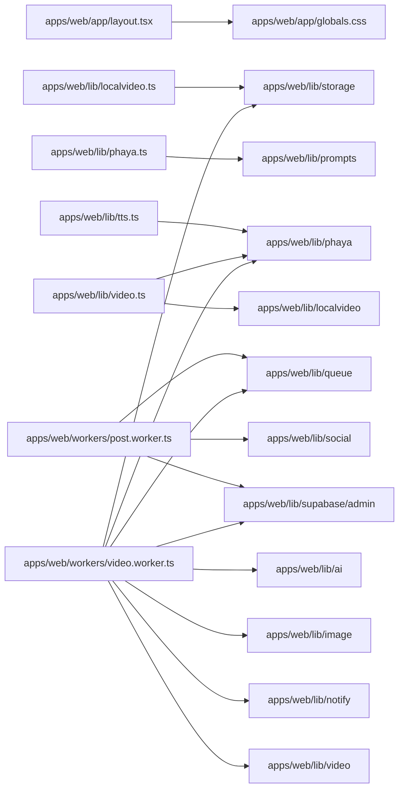

# Project Graph

Generated: 2026-06-22T00:50:01.9313448+07:00

## Data Flow & Dependencies

## Source Inventory

- `apps/web/app/(dashboard)/agent/page.tsx`
- `apps/web/app/(dashboard)/analytics/page.tsx`
- `apps/web/app/(dashboard)/captions/page.tsx`
- `apps/web/app/(dashboard)/control/page.tsx`
- `apps/web/app/(dashboard)/guide/page.tsx`
- `apps/web/app/(dashboard)/jobs/page.tsx`
- `apps/web/app/(dashboard)/layout.tsx`
- `apps/web/app/(dashboard)/menus/page.tsx`
- `apps/web/app/(dashboard)/page.tsx`
- `apps/web/app/(dashboard)/planner/page.tsx`
- `apps/web/app/(dashboard)/settings/page.tsx`
- `apps/web/app/(dashboard)/upload/page.tsx`
- `apps/web/app/api/agent/route.ts`
- `apps/web/app/api/brief/route.ts`
- `apps/web/app/api/captions/route.ts`
- `apps/web/app/api/generate/route.ts`
- `apps/web/app/api/jobs/[id]/route.ts`
- `apps/web/app/api/jobs/route.ts`
- `apps/web/app/api/master/route.ts`
- `apps/web/app/api/menu-image/route.ts`
- `apps/web/app/api/menus/route.ts`
- `apps/web/app/api/status/route.ts`
- `apps/web/app/api/upload/route.ts`
- `apps/web/app/layout.tsx`
- `apps/web/app/login/page.tsx`
- `apps/web/app/page.tsx`
- `apps/web/components/agent/AgentChat.tsx`
- `apps/web/components/analytics/AnalyticsDashboard.tsx`
- `apps/web/components/dashboard/JobList.tsx`
- `apps/web/components/menus/MenuCatalog.tsx`
- `apps/web/components/planner/ContentPlanner.tsx`
- `apps/web/components/planner/MonthlyCalendar.tsx`
- `apps/web/components/settings/SettingsForm.tsx`
- `apps/web/components/upload/MenuUploader.tsx`
- `apps/web/lib/agents.ts`
- `apps/web/lib/ai.ts`
- `apps/web/lib/fal.ts`
- `apps/web/lib/image.ts`
- `apps/web/lib/llm.ts`
- `apps/web/lib/localvideo.ts`
- `apps/web/lib/notify.ts`
- `apps/web/lib/phaya.ts`
- `apps/web/lib/prompts.ts`
- `apps/web/lib/queue.ts`
- `apps/web/lib/social.ts`
- `apps/web/lib/storage.ts`
- `apps/web/lib/supabase/admin.ts`
- `apps/web/lib/supabase/client.ts`
- `apps/web/lib/supabase/server.ts`
- `apps/web/lib/tools.ts`
- `apps/web/lib/tts.ts`
- `apps/web/lib/video.ts`
- `apps/web/middleware.ts`
- `apps/web/next.config.mjs`
- `apps/web/next-env.d.ts`
- `apps/web/postcss.config.js`
- `apps/web/tailwind.config.ts`
- `apps/web/workers/post.worker.ts`
- `apps/web/workers/video.worker.ts`
- `start-dev.ps1`

## Notes

- Verify important behavior from source files before editing.
- Source file cap: 200
